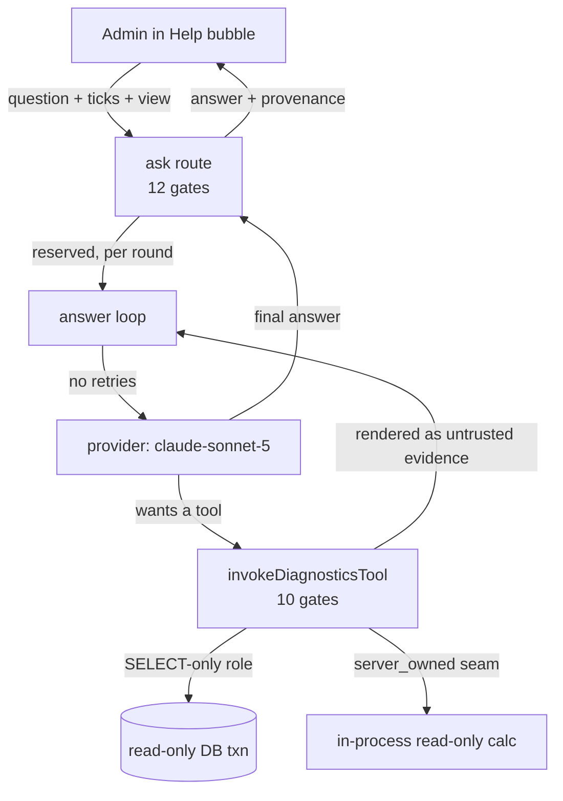

# AI Diagnostics — architecture

> Part of the [AI Diagnostics hub](README.md) and the
> [documentation hub](../README.md).

The end-to-end shape of the shipped AI Diagnostics product: how a question travels
from the Help bubble to a cited answer, where every security control sits on that
path, and which module owns each one. It is the developer/reviewer companion to the
operator-facing [deployment guide](deployment.md) and the
[security verification matrix](e2e-matrix.md).

AI Diagnostics is a **separate, admin-only, read-only** investigation product, not
the member-facing Page help assistant (see
[ADR-001](decisions/ADR-001-separate-admin-only-diagnostics-product.md)). It ships
**off by default**; nothing below runs for a deployment that has not enabled the
module, stored the dedicated key, set a budget, and provisioned the SELECT-only role.

## The request path, end to end

A question is asked from the Help bubble on whichever admin screen the operator is
on, and answered by one route. The pieces, in order:

1. **The shell** — `src/components/help-widget/diagnostics-view.tsx`, a tab inside
   the Help bubble. It shares the bubble's doorway with Page help but is a wholly
   separate surface: its own conversation (`use-diagnostics-chat.ts`), its own
   endpoint, its own consent controls, its own provenance line. The setup/status
   page at `src/app/(admin)/admin/ai-diagnostics/page.tsx` owns readiness and the
   budget only; **all asking happens in the bubble** (owner decision D8).
2. **The ask route** — `src/app/api/admin/ai-diagnostics/ask/route.ts`. A single
   `POST` handler that runs twelve ordered gates before any answer is produced
   (below). It persists no conversation: the transcript arrives in the request,
   is replayed as untrusted data, and is gone when the response is written (owner
   decision Q5).
3. **The answer loop** — `src/lib/diagnostics/answer/loop.ts`
   (`runDiagnosticsAnswer`). A bounded multi-round loop that reserves budget,
   calls the provider, settles the spend, invokes any requested tools, and renders
   their results back as untrusted evidence. It holds no permission logic of its
   own; it sequences controls that live elsewhere.
4. **The provider** — `src/lib/diagnostics/answer/provider.ts`
   (`runDiagnosticsProviderRound`). `claude-sonnet-5` (owner decision Q1), a
   60-second request timeout, and **zero SDK retries** — a retry would be a paid
   call the budget reservation never saw. It never throws; a fault becomes a typed
   failure the loop maps to an operator sentence.

## The route's twelve gates

The gate order in the route is itself the contract; none may be reordered without
re-deciding the reason it sits where it does. In brief:

1. **Admission** — any admitted administrator, encoded as
   `permission: "any-admin"` (owner decision Q6, ADR-002 §1): view or better on
   at least one of the seven areas. Opening the route grants **zero** evidence
   access; every tool re-checks its own area on every call. It was written
   `overview:view` until #2984 made portal standing any one area, at which point
   that spelling stopped meaning "any admitted admin" and started excluding the
   shipped Finance Viewer grid.
2. **Rate limits** — per-IP then per-admin, **before the body is parsed**, so an
   unparseable or oversized body is still throttled. Diagnostics has its own
   limiters, separate from Page help's.
3. **Module** — fail-closed, before the body is parsed, answering with the module
   gate's own frozen **404** so a module-off deployment is byte-indistinguishable
   from an address that never existed.
4. **Body** — strict `zod`; unknown keys are rejected, and control characters are
   refused in the question and every replayed turn.
5. **Global backstop** — the deployment-wide rate-limit ceiling.
6. **Metering** — can't-record ⇒ don't-spend (the metering circuit breaker,
   [ADR-005](decisions/ADR-005-budget-rate-limits-tool-loop-fail-closed.md) §5).
7. **Offer matrix** — the caller's permission areas, re-read **fresh** from the
   database, deciding which tools are offered and how a refusal is worded.
8. **Readiness** — the same fail-closed verdict the page shows; the credential
   detail is support-only.
9. **Credential** — the **dedicated** diagnostics key, never the Page-help one.
10. **Context** — the client's page selector is **re-resolved server-side** under
    this admin's own freshly-read authority before any record is read.
11. **Consent** — this question's ledger, seeded **only** from what step 10
    actually resolved plus the operator's two per-request ticks.
12. **Answer** — the bounded loop.

## The tool substrate

The headline is a negative capability: **the model never supplies SQL.** A tool is
a server-owned record pairing a fixed statement, a fixed parameter binding, a fixed
projection, fixed row/byte ceilings and a fixed permission requirement
(`src/lib/diagnostics/tools/`). The model chooses an entry by id and supplies
arguments a `.strict()` schema has already accepted; those become positional
parameters and nothing else. Full reference: [`tools.md`](tools.md).

Each invocation (`invokeDiagnosticsTool`, `src/lib/diagnostics/tools/invoke.ts`)
runs **ten ordered fail-closed gates**, every one returning no rows: registry, loop
budget, fresh authorization, arguments, channel, consent, metering, credential,
read, projection, size, audit. Two properties matter most:

- **Authorization is per invocation, and withholding is not authorization.** Tool
  definitions are hidden from a caller who lacks the area — a usability courtesy —
  while the executor re-reads the caller's matrix from the database and denies on
  every invocation regardless (`definitions.ts` is emphatic that withholding is
  courtesy, never the control).
- **Authorization runs before argument parsing**, so the difference between
  "invalid arguments" and "permission denied" cannot be used as an oracle.

### The SELECT-only role and the server_owned seam

Tools read the domain through **two** read-only seams, never the application's
own database role:

- **The SELECT-only database role.** Reads run as `AI_DIAGNOSTICS_DATABASE_URL` —
  a dedicated non-superuser role with a column-level `SELECT` allowlist — inside a
  `BEGIN READ ONLY` transaction under a statement timeout. The application asks the
  **server** what the role actually holds and refuses every tool call unless the
  answer is the least-privilege shape
  [ADR-007](decisions/ADR-007-least-privilege-select-only-database-credential.md)
  requires, re-read at least once a minute. There is no fallback to `DATABASE_URL`.
  Provisioning, the exact allowlist, and readiness are documented in the
  [deployment guide](deployment.md); the code is
  `src/lib/diagnostics/tools/database.ts` and
  `src/lib/diagnostics/tools/provision-role.ts`.
- **The server_owned seam.** Three authoritative calculations
  (`booking_block_state`, `booking_capacity_by_night`, `member_eligibility_state`)
  run the platform's **own** evaluators in-process rather than re-reading columns —
  the capacity engine, the soft-policy evaluator, the lifecycle resolver, and the
  rest — inside one `REPEATABLE READ` read-only transaction. Their collaborators are
  bound to that transaction so a rule cannot make an unthreaded write or an
  inconsistent read; the read-only property is proven against a real database
  (`src/lib/__tests__/ai-diagnostics-readonly-seam.realdb.test.ts`).

## The knowledge bundle

Code, docs, and schema questions are answered from a **deterministic, fail-closed
deployed-code knowledge bundle** (AID-3), not from the model's memory. The bundle is
generated at build time from the deployed artifact
(`scripts/diagnostics/generate-knowledge-bundle.ts`), secret-scanned, hashed, and
retrieved with cited excerpts at ask time
(`src/lib/diagnostics/knowledge/`). A missing bundle is the expected
"not-provisioned" case, **not** a refusal: the answer proceeds on runtime evidence
alone. Full reference: [`KNOWLEDGE_BUNDLE.md`](../diagnostics/KNOWLEDGE_BUNDLE.md).

The build-time **allowlist overlay** (`config/diagnostics-knowledge.json`) can widen
or narrow which of the repository's own files enter the bundle. A deployment may
also supply the broader ADR-006 §4 **private knowledge overlay** — extra private
knowledge layered on the public bundle, entering as untrusted evidence through the
same secret-scan, role-label defusal, and single integrity digest — **built this
release** (#2861); see
[`deployment.md`](deployment.md#the-private-knowledge-overlay-adr-006-4).

## The consent ledger and the permission model

Two independent layers decide what an investigation may see:

- **The permission model** is per-area and per-invocation. Each tool declares the
  admin area that already governs its data in the admin UI (`support`, `bookings`,
  `membership`, `finance`), re-checked at `view` on every call; cross-area tools
  require **all** of their named areas
  ([ADR-002](decisions/ADR-002-admission-and-per-tool-authorization-lattice.md)).
  Admission to the shell is any-admin and reveals nothing.
- **The consent ledger** is a server-held, per-**request** record of what personal
  data this question may touch (`src/lib/diagnostics/tools/consent.ts`,
  [ADR-004](decisions/ADR-004-sensitive-context-retention-redaction-audit-metadata.md)).
  It is seeded **only** from the record the server itself resolved from the page
  context and from the operator's two per-question ticks — a personal-details tick
  and a people-search tick — both of which **reset after every send**. It extends
  one hop out by absorbing the projected fields an entry declares. An entry that
  reads a named record refuses when the operator did not put that record in scope
  (`record_not_included`); a model-invoked people search refuses without the search
  tick. The durable `AuditLog` row records the decision, never the content.

Only **approved metadata** is ever retained: tool id, areas checked, auth outcome,
row/byte/timing counts, and non-reversible hashes of the accepted arguments and of
the result — never prompts, answers, arguments, results, payloads, credentials, or
unrestricted identifiers.

## Untrusted text: the defusal boundary across all five evidence channels

**All evidence is untrusted, prompt-injection-capable data**: it never carries
system authority and never authorizes a tool
([ADR-003](decisions/ADR-003-untrusted-evidence-classes.md)). Five channels feed
text into a round, and every one is treated as data, wrapped, and neutralised — none
is ever replayed as `assistant`-authority content:

| Channel | Source | Where it is defused |
| --- | --- | --- |
| `deployed_source_evidence` | the knowledge bundle excerpts (AID-3) | `src/lib/diagnostics/knowledge/retrieve.ts` render |
| page context | the re-read facts of the screen the operator is on (AID-4) | `src/lib/diagnostics/page-context/render.ts` |
| tool result | rows a SELECT-only tool returned this round | `src/lib/diagnostics/tools/render.ts` |
| conversation | the prior turns the browser replayed | `src/lib/diagnostics/answer/prompt.ts` |
| question | the operator's current question | `src/lib/diagnostics/answer/prompt.ts` |

The shared primitive is the **fold** (`src/lib/diagnostics/untrusted-text.ts`): every
untrusted span is normalised first — invisible and default-ignorable code points
dropped, NFKC-normalised, colon look-alikes folded, and every line terminator and
control character turned into a newline or a space — **before** the line-anchored,
role-label defusal runs, so the defusal sees the text the model will. The system
prompt is frozen with no interpolation, and the whole prior conversation is replayed
as **one wrapped user turn**, bounded per turn and per block. As a boundary
belt-and-braces, the ask route refuses C0/DEL/C1 characters in the question and in
any replayed turn outright: a request carrying a non-printing character there is
malformed, and silently repairing it is how a bypass gets built.

The rendered **answer** is itself untrusted *output*: it is inert text under a strict
CSP whose `img-src`/`connect-src` blocks egress, so an injection cannot beacon
in-scope data out of the admin's browser
([ADR-008](decisions/ADR-008-answer-output-channel-inert-render-csp.md)).

## Budget, rate limits, and recovery

The control plane is fail-closed and denies the paid call on any doubt
([ADR-005](decisions/ADR-005-budget-rate-limits-tool-loop-fail-closed.md); code in
`src/lib/ai-diagnostics-usage.ts`):

- **Budget** is a deployment-local monthly figure in NZ **integer cents**, default
  **NZ$0 = hard-off**. Each provider roundtrip **reserves** worst-case cents under a
  per-month advisory lock before the call, and **settles** the real (usually far
  smaller) cost after it — on success and on failure alike, because an unsettled
  reservation is spend nobody can see. The money-safety property (no burst of
  concurrent reservers can push `settled + reserved` over budget) is proven against
  a real PostgreSQL (`src/lib/__tests__/ai-diagnostics-budget-race.realdb.test.ts`).
- **The loop is bounded** to `DIAGNOSTICS_MAX_TOOL_ROUNDS` (8) provider rounds per
  question, so a single session's worst-case spend is finite and the monthly budget
  bounds the sum across sessions.
- **Rate limits** are auth-sensitive: per-admin, per-IP, and a global backstop. A
  degraded shared-store fallback runs at a **tighter** limit — a store outage
  tightens, never loosens, the paid-call backstop.
- **Recovery** is honest, not silent: a spent budget, a busy or unavailable
  provider, a throttle, and a round-limit exhaustion each map to their **own**
  operator sentence and next action rather than a bare "AI failed", and none of them
  ever tells the operator to reload (a reload during database contention makes the
  cause worse).

## Deferred: ADR-006 postures

Two ADR-006 deployment postures are **not implemented in this release** and are
documented honestly rather than as if they shipped: provider/data-residency
**disclosure** (§2) and the optional **zero-retention** provider posture (§3). The
§4 deployment-owned **private knowledge overlay** shipped this release (#2861) —
distinct from the build-time allowlist overlay above, which is only a filter over the
repository's own files. See the [deployment guide's deferred table](deployment.md#deferred-provider-disclosure-and-zero-retention)
for what each means for an operator.

## Related links

- Back to the [AI Diagnostics hub](README.md) and the
  [documentation hub](../README.md).
- [Deployment and operator guide](deployment.md) — setup, the SELECT-only role,
  readiness, and the deferred ADR-006 postures.
- [Security verification matrix](e2e-matrix.md) — what AID-8 proved and how.
- [Tool substrate](tools.md), [page context](page-context.md),
  [knowledge bundle](../diagnostics/KNOWLEDGE_BUNDLE.md), and the
  [threat model](threat-model.md).
- The repository-wide [`ARCHITECTURE.md`](../ARCHITECTURE.md) and
  [`DOMAIN_INVARIANTS.md`](../DOMAIN_INVARIANTS.md) this extends.
