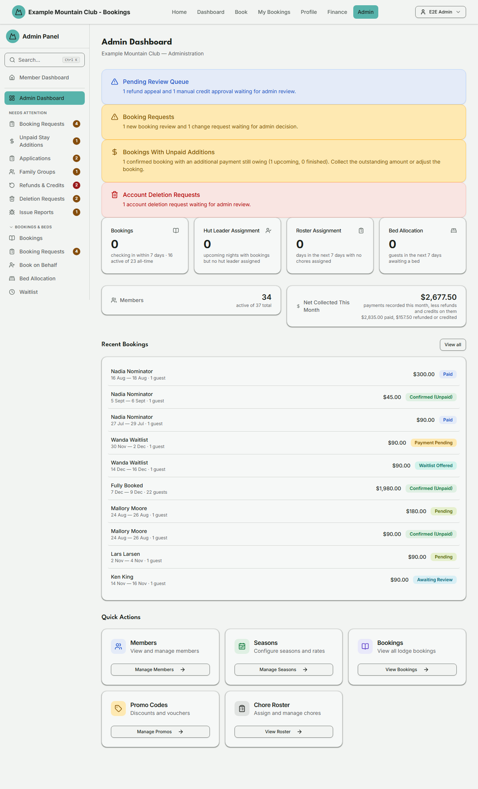

# Admin Dashboard

Audience: Operator

## What it is

The admin landing page: a set of **attention cards** for work that needs a
decision, headline **stat cards** for the club's numbers, a **Recent Bookings**
list, and **Quick Actions** shortcuts. Find it at **Admin → Admin Dashboard**
(`/admin/dashboard`).

Everything on the dashboard is a link into the area that owns the detail — the
dashboard never edits anything itself. The attention cards mirror the sidebar's
**Needs Attention** section (see [`ARCHITECTURE.md`](../ARCHITECTURE.md) →
Needs Attention / badges): a card appears only while its queue has something
pending and disappears once the queue is clear, so it never implies work that
isn't there.

## When you'd use it

- You've just logged in and want the one-screen view of what needs doing today.
- You want a quick count of active members, upcoming check-ins, or the money
  collected this month net of refunds, without opening the detailed reports.
- You want to jump to a pending queue (refund appeals, booking reviews, deletion
  requests) straight from the alert that surfaced it.

## Step-by-step

### Read the dashboard

1. Go to **Admin → Admin Dashboard**.

   

2. Scan the **attention cards** at the top. Each is a shortcut to the queue that
   raised it — click through to act on it.
3. Use the **stat cards** for the headline numbers, or the **Quick Actions**
   tiles to jump to Members, Seasons, Bookings, Promo Codes, or the Chore
   Roster.

### Find any page fast (command palette)

The admin panel has around ninety pages across ten sidebar sections, so you
don't have to remember which section hides a feature.

- Press **Ctrl + K** (Windows/Linux) or **⌘ + K** (Mac) from any admin page, or
  click the **Search…** button at the top of the sidebar.
- Start typing a page name — or a related word, such as "accounting" for Xero
  Sync or "permissions" for Access Roles — then use the **arrow keys** to move,
  **Enter** to open the highlighted page, and **Escape** to close.
- The palette only ever lists pages **you** can open: it applies exactly the
  same permission rules as the sidebar, so a page you aren't permitted to see
  never appears here.
- It lists every page the sidebar *could* show you, which is slightly more than
  the sidebar shows at any one moment. The two attention shortcuts — **Unpaid
  Finished Stays** and **Unpaid Stay Additions** — stay searchable as
  pre-filtered views even when nothing is currently owing, whereas the sidebar
  only surfaces them while their queue has something in it.

## Settings reference

The dashboard has no settings — it is read-only. The cards it can show:

| Card | Appears when | Opens |
| --- | --- | --- |
| Pending Review Queue | Refund appeals or manual credit approvals are waiting | [Refunds & Credits](refund-requests.md) |
| Booking Requests | New booking reviews or change requests are waiting | [Booking Requests](booking-requests.md) |
| Unpaid Finished Stays | A stay ended but is still payment-pending | [Bookings](bookings.md) (pre-filtered) |
| Finished Stays With Unpaid Additions | A settled past stay has an upward change still uncollected | [Bookings](bookings.md) (pre-filtered) |
| Account Deletion Requests | A member self-service deletion is pending | [Deletion Requests](deletion-requests.md) |
| Membership Lifecycle Review | A cancellation or archive request is waiting | [Cancellation Requests](membership-cancellations.md) |
| Hut Leader Assignment Required | Upcoming dates have bookings but no hut leader. On a club with more than one active lodge this counts **lodge-nights** and names the lodge on every date, because each lodge needs its own leader — see [Hut Leaders](hut-leaders.md) | [Hut Leaders](hut-leaders.md) |

Stat cards (each links to its detail area):

| Stat | What it counts |
| --- | --- |
| Bookings | Bookings checking in within the next 7 NZ days (the same list **Bookings** opens to), with the count of active bookings (pending, payment-pending, confirmed, paid and awaiting review) and all-time bookings (excludes deleted) beneath |
| Hut Leader Assignment | Upcoming nights (lodge-nights on a club with more than one active lodge) that have bookings but no hut leader |
| Roster Assignment | Days in the next 7 days with no chores assigned |
| Bed Allocation | Guests in the next 7 days still waiting for a bed |
| Members | Active members, with the total beneath |
| Net Collected This Month | Payments **recorded** this calendar month, **less the refunds and account credits on them**. A payment counts in the month its record was created, even if the money arrived later: an Internet Banking payment is recorded, as pending, when the booking is made, and counts in that month once it is paid. Only payments that have taken money count, so one still pending or failed is left out. Cancelled bookings are **included**, so a cancellation fee the club kept counts here; deleted bookings are left out. Every Net Collected figure (this card, the Payments page's and Reports') uses that same rule for which bookings count. When anything has been refunded or credited, the amount paid and the amount refunded or credited are shown beneath the headline, in exact cents like the headline, so the arithmetic on the card adds up |

## Troubleshooting

| Symptom | Likely cause | Fix |
| --- | --- | --- |
| An attention card vanished | Its queue is now empty | Nothing to do — the card only shows while work is pending |
| Net Collected looks wrong for the month | It is **net of refunds and credits**, and it groups payments by the month their record was **created**, not the month the money arrived. A bank transfer paid this month on a booking made last month counts in last month; a refund made this month on last month's payment reduces last month, not this one. A cancelled booking counts at the fee the club kept | Use [Reports](reports.md) for a chosen date range, or [Payments](payments.md) for a filtered list |
| A quick-action tile is missing | The related module is off (e.g. Chore Roster needs the `chores` module) | Enable it in [Modules](modules.md) |

## Related links

- Back to the [documentation hub](../README.md).
- Sibling queues: [Booking Requests](booking-requests.md),
  [Refunds & Credits](refund-requests.md),
  [Deletion Requests](deletion-requests.md),
  [Cancellation Requests](membership-cancellations.md).
- Reference: the Needs Attention / badges model in
  [`ARCHITECTURE.md`](../ARCHITECTURE.md).
