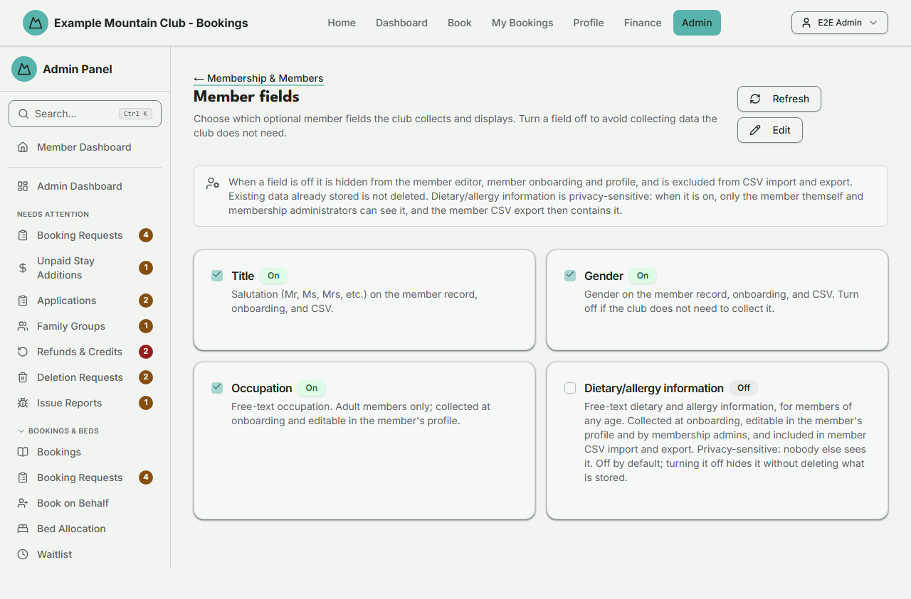

# Member Fields

Audience: Operator

## What it is

A short settings page that chooses which **optional member profile fields** — a
**Title** (salutation), **Gender**, **Occupation** and **Dietary/allergy
information** — the club collects and displays. Turning a field off hides it from the member editor, onboarding and
profile, and CSV import/export; data already stored is not deleted. Find it at
**Admin → Setup & Configuration → Membership & Members → Member Fields**
(`/admin/member-fields`); it has no direct sidebar entry — reach it through the
[Membership & Members setup hub](membership-setup.md).

Member fields are a **membership** permission area: membership view to read,
membership **edit** to save.

## When you'd use it

- Your club does not collect a member's gender or occupation and you want to stop
  asking for it.
- You want to add a salutation/title to member records and onboarding.
- Your hut leaders or caterers need to know about members' dietary needs and
  allergies, and you want members to record them once on their own profile.

## Step-by-step

### Toggle a field

1. Go to **Member Fields** (via **Membership & Members**). Each field is a card
   with an **On**/**Off** badge. The page opens **read-only**.

   

2. Click **Edit**. The checkboxes unlock and **Save** and **Cancel** appear.
3. Tick or untick the fields as needed, then click **Save**. **Save** stays
   disabled until you have changed something; **Cancel** puts every box back the
   way it was. Use **Refresh** (while not editing) to reload the current settings.

## Settings reference

| Field | What it controls | Default | Notes / constraints |
| --- | --- | --- | --- |
| Title | Salutation (Mr, Ms, Mrs, …) on the record, onboarding, and CSV | On | — |
| Gender | Gender on the record, onboarding, and CSV | On | Turn off if the club does not collect it |
| Occupation | Free-text occupation | On | Adult members only; onboarding + profile |
| Dietary/allergy information | Free-text dietary needs and allergies, up to 500 characters | **Off** | Any age tier; onboarding, profile, the admin member editor, and member CSV import/export. Privacy-sensitive — see below |

When a field is off it is hidden everywhere it would otherwise appear (the member
editor, dependent dialog, onboarding, profile, and CSV import/export). **Existing
stored data is not deleted** — turning the field back on shows it again.

### Dietary/allergy information is privacy-sensitive

This field holds health-related personal information, and for children too, so
it behaves differently from the other three:

- **It is off until you turn it on.** A new installation and an upgraded one
  both start with it off.
- **Who can see a value:** the member themself (on their own profile and during
  onboarding) and admins with **membership** access (the member editor, the
  member CSV, and member merge). Nobody else — not other family members, not
  hut leaders or lodge screens, not the booking or finance exports — sees it.
  A later release adds hut leaders for the members on their own stay.
- **It never leaves for Xero**, the analytics tag, notifications or logs.
- **The member CSV export contains it while the field is on.** Treat that file
  as sensitive: store and share it only as your club's privacy policy allows.
- **Audit history records only that it changed**, never what it says.
- **A member's own data export** (Profile → download my data) always includes
  their stored value, even while the field is off, because that export promises
  everything held about them.
- Turning it off hides it everywhere else but keeps what members recorded, so
  turning it back on shows it again. To delete a value, clear it on the member's
  record while the field is on.

## Troubleshooting

| Symptom | Likely cause | Fix |
| --- | --- | --- |
| Everything is read-only ("… can view member fields but cannot change them") | Your admin role has membership view but not edit | Ask a full admin for membership edit access |
| The checkboxes cannot be ticked | The page is read-only until you click **Edit** | Click **Edit** first |
| **Save** is disabled | You have not changed anything yet | Toggle a field; Save enables once the form is dirty |
| Members cannot see the dietary field | It is off by default | Turn **Dietary/allergy information** on and save |
| The member CSV has no dietary column | The field is off, or your admin role lacks membership access | Turn the field on; ask a full admin for membership access |
| A field I turned off still shows old data somewhere | Turning a field off hides the input but does not erase stored values | This is expected; the data reappears if you turn the field back on |

## Related links

- Back to the [documentation hub](../README.md).
- Sibling guides: [Membership & Members setup](membership-setup.md),
  [Membership Types](membership-types.md), [Members](members.md).
- Reference: CSV field behaviour in
  [`CONFIGURATION.md`](../../CONFIGURATION.md#member-import-and-addresses).
- The privacy rule for dietary/allergy information:
  [`INV-PRIV-022`](../invariants/analytics-and-privacy.md#inv-priv-022).
