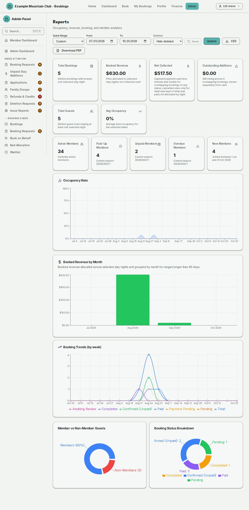

# Reports

Audience: Operator

## What it is

A read-only analytics dashboard for booking occupancy, booked revenue, collected cash, booking-status
trends, and member-subscription stats over a date range you choose, with CSV and
PDF export. Find it at **Admin → Finance → Reports** (`/admin/reports`).

This page is a **finance** permission area: you need finance view access to open
it. Money is stored as integer cents and shown to exact cents; dates are NZ
date-only lodge nights, interpreted in the club time zone.

## When you'd use it

- You want the season's or month's occupancy, revenue, and guest totals for a
  committee update.
- You need to see booking trends or the split of member vs non-member guests.
- You want a snapshot of member subscription health (paid-up, unpaid, overdue,
  new members).
- You need to export the figures as CSV or a PDF.

## Step-by-step

### Open and set the range

1. Go to **Admin → Finance → Reports**. Set the **From** and **To** dates (or
   pick a **Quick Range** such as This Month, Next Month, or Last Quarter),
   choose whether to include deleted bookings, and click **Update**. Choosing a
   quick range changes only the dates; your Lodge and Deleted selections stay
   as they are.

   

2. If the club runs more than one lodge, a **Lodge** selector lets you scope
   every booking-derived figure and occupancy to one lodge or all lodges.
   **Reset** restores the
   rolling default date window and **Hide deleted**, but keeps that lodge scope.

### Read the figures

1. The top cards show **Total Bookings**, **Booked Revenue**, **Net
   Collected**, **Outstanding Additions**, **Total Guests**, and **Avg Occupancy** for
   the range. A booking counts once when one of its lodge nights overlaps the
   inclusive From/To dates. Each guest row counts once when its own half-open
   `[stayStart, stayEnd)` envelope overlaps that range; sparse per-night rows do
   not replace the guest envelope for this total. The second row shows
   member stats (Active, Paid-Up, Unpaid, Overdue, New) for the current season.
   If payment summary data claims an additional payment was collected without a
   matching captured additional-payment record, a warning above the cards says
   how much **Net Collected** may understate and how many bookings need a
   developer to reconcile their payment ledgers before the figure is trusted.
   A separate red **Booked Revenue needs reconciliation** warning counts
   bookings whose stored headline does not reconcile to its recorded parts.
   The report keeps the stored figures unchanged and includes counts for every
   reason in the CSV so an operator can investigate without guessing a value.
2. The charts show **Occupancy Rate**, **Booked Revenue by Day/Week/Month** (the
   granularity is chosen automatically from the range length), **Booking Trends
   (by week)**, **Member vs Non-Member Guests**, and **Booking Status
   Breakdown**.

### Export

1. Click **CSV** to download the figures as a spreadsheet, or **Download PDF**
   for a printable version. Both are enabled once the data has loaded. Any Net
   Collected reconciliation warning and its aggregate amount/count are
   included in both exports; individual booking IDs and transaction rows are
   not exported.

Exports and printing always come out in the light colour scheme — dark text on a
white page — even when you are browsing the app in dark mode. You do not need to
switch themes before exporting.

## Settings reference

This page is read-only. Its controls:

| Control | What it does | Default | Notes / constraints |
| --- | --- | --- | --- |
| Quick Range | Preset date range | Custom | This Month, Last Month, Next Month, Last Quarter, Year to Date, Last Year |
| From / To | The reporting date range | month-of (today - 3 months) to end-of-month of today | NZ date-only, club time zone; To must be after From |
| Lodge | Scope metrics to one lodge | All lodges | Only shown with more than one active lodge |
| Deleted | Include soft-deleted bookings | Hide deleted | Include deleted, or Deleted only |
| Reset | Restore the date range and Deleted filter | start of the month three months prior through current month-end; Hide deleted | Keeps the selected lodge; disabled at defaults |
| Update | Re-run the query | — | — |
| CSV | Download the figures as CSV | — | Filename `tac-report-<date>.csv` |
| Download PDF | Generate a printable PDF | — | Falls back to the browser print dialog on error; always rendered light-on-white regardless of your theme |

Notes: **Booked Revenue** is the booking system's price allocated over lodge
nights (`checkIn` inclusive, `checkOut` exclusive). The full integer-cent
`finalPriceCents` is divided before the selected range is sliced, so a $1.00
three-night stay contributes $0.34, $0.33, and $0.33. The booking cohort is the
explicit current statuses Pending, Payment Pending, Confirmed, Paid, Awaiting
Review, and Completed; drafts, waitlist placeholders, bumped, and cancelled
bookings do not silently become revenue.

**Net Collected** is different: it is the money the club kept on the
overlapping bookings — captured `Payment.amountCents` less refunds and
credits, plus account credit a cancellation kept, less refunds still owed back
on cancelled bookings — and it is not allocated to individual nights.
It does not use the status list above. It counts every overlapping booking in
the chosen lodge whatever its status, so a cancelled booking counts what the
club kept of what was paid on it: money not refunded, credited or owed back by
hand, plus account credit the cancellation kept (nothing at all if it was
cancelled before anything was paid), and it leaves deleted bookings out whichever
**Deleted** view is chosen. All four Net Collected figures (this card, the
dashboard's, the Payments page's and the Finance dashboard's Net
Collected) use that same rule for which bookings count.
A captured later addition is already inside that payment amount and is never
added again. **Outstanding Additions** remains the booking-level amount still
owing after an upward change. Do not subtract it from selected stay-night
revenue and call the result cash — the payment row owns the cash figure. All
three appear separately in the CSV. The page cards, revenue chart axis and
tooltips, CSV, and PDF-rendered page all preserve exact cents, including whole
dollar values such as `$135.00`.

Reports also preserves the Finance dashboard's #2408 consistency guard. When a
positive `additionalAmountCents` is marked `SUCCEEDED` but no captured
`ADDITIONAL` payment transaction supports it, the cash arithmetic does not
change: **Net Collected** is worked out exactly as above. The
page, CSV, PDF, and server log instead flag the aggregate possible shortfall so
an operator does not silently reconcile against a figure the ledger cannot
prove. The API returns only the aggregate cents and booking count; affected
booking IDs remain confined to the bounded server log. The Payments page's
**Net Collected** card and the Finance dashboard's **Net Collected**
card each run the same check over the payments they count and show the same
warning; the dashboard's **Net Collected This Month** card does not, because it
reads only each payment's status and amounts, with no ledger rows to check.

Occupancy deliberately keeps its narrower PAID/COMPLETED meaning and excludes
custodian bed holds, so a Confirmed booking can appear in bookings/revenue while
not increasing this utilisation chart. The member stat cards always use the
current season's data (shown in the print header); occupancy is sampled to keep
long ranges readable.

## Troubleshooting

| Symptom | Likely cause | Fix |
| --- | --- | --- |
| A red error banner appears | The date range is invalid (To not after From) or the query failed | Fix the dates and click **Update** |
| CSV / PDF buttons are greyed out | The data has not finished loading | Wait for the dashboard to load, then export |
| A chart says "No … data for this period" | There is no matching data in the range | Widen the range or change the Deleted / Lodge filter |
| Occupancy shows 0% | No bed-nights were occupied in the range, or capacity is unset | Check the range and the lodge's capacity setup |
| Booked Revenue looks lower than the booking's full price | Only the booking's price allocation for selected stay nights is included | Expand the range to the booking's complete stay |
| Booked Revenue and Net Collected differ | They measure different things: selected stay-night price versus the money kept on each booking (captured cash less refunds and credits, plus credit a cancellation kept, less refunds owed back) | Use the [Payments](payments.md) ledger for the transaction detail |
| Outstanding Additions is non-zero | A price increase is still owing on an overlapping booking | Chase it from [Bookings](bookings.md#chase-money-still-owed-after-a-booking-change) |
| "Net Collected needs reconciliation" appears | One or more payments say an addition was collected without a matching captured additional-payment record | Ask a developer to reconcile the affected payment ledgers before trusting Net Collected; the warning states the possible understatement and booking count |
| "Booked Revenue needs reconciliation" appears | One or more stored booking headlines have missing or disagreeing recorded parts | Open the affected bookings from the booking list's **Money review** chips; do not reprice unknown history or treat the warning as an automatic correction |

## Related links

- Back to the [documentation hub](../README.md).
- Feature hub: [Finance dashboard](../finance-dashboard/README.md).
- Sibling guides: [Payments](payments.md), [Bookings](bookings.md).
- Reference: [finance reporting](../ARCHITECTURE.md#finance-reporting) in the
  architecture doc, and the
  [booking/payment flow](../ARCHITECTURE.md#booking-and-payment-flow).
